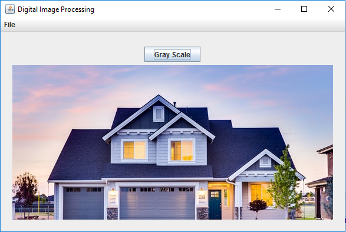
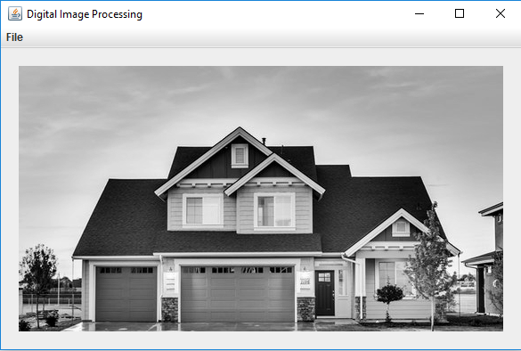

Digital Image Processing
=========================

The basic of digital image processing in JAVA

## Gray Scale

Before



After




The Real Deal Function

```java

package org.example.utils;

import java.awt.*;
import java.awt.image.BufferedImage;

public class ImageHelper {

    public static BufferedImage grayScale(BufferedImage bufferedImage) {

        for (int i = 0; i < bufferedImage.getHeight(); i++) {

            for (int j = 0; j < bufferedImage.getWidth(); j++) {
                Color c = new Color(bufferedImage.getRGB(j, i));

                int red = (int) (c.getRed() * 0.299);
                int green = (int) (c.getGreen() * 0.587);
                int blue = (int) (c.getBlue() * 0.114);

                Color newColor = new Color(red + green + blue, red + green + blue, red + green + blue);

                bufferedImage.setRGB(j, i, newColor.getRGB());

            }
        }

        return bufferedImage;

    }

}

```